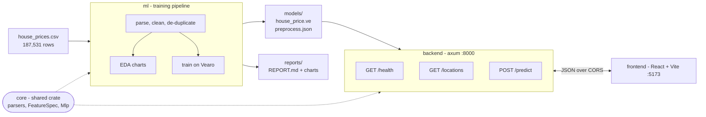
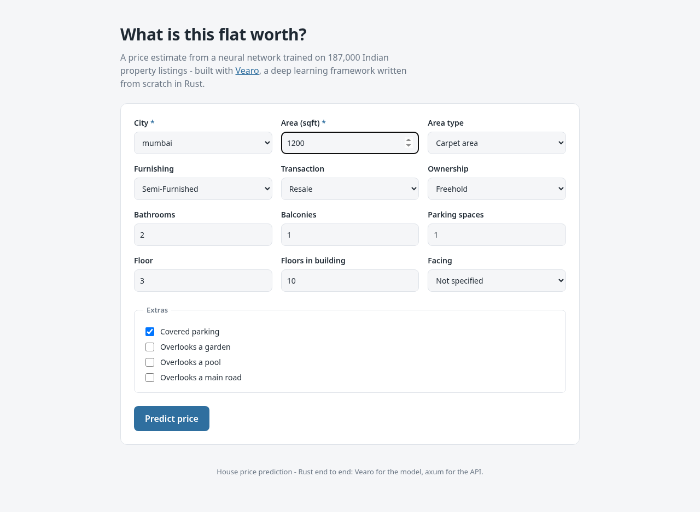
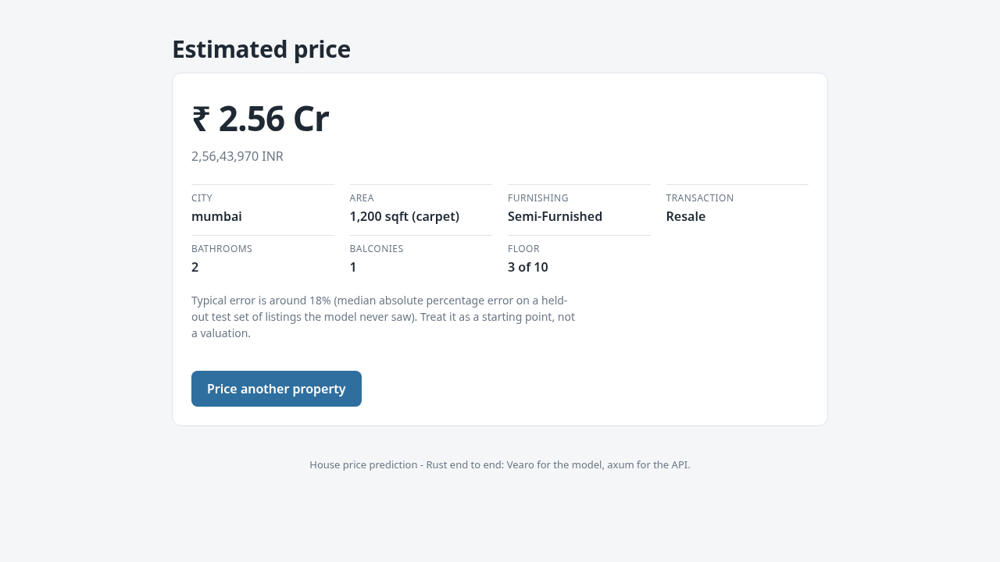

# House Price Prediction

Guesses what a flat or house in India is worth from its city, floor area, layout and condition.
It's trained on a Kaggle dataset of 187k listings, there's a JSON API on top, and a React form
to poke at it.

There's a sibling repo, [`house-price-app`](https://github.com/0saiog/house-price-python), that does
the same thing in Python.
using [Vearo](https://github.com/razecrs/vearo) for the model. The two agree on the data down to the row,
see [Cross-check](#cross-check).

The brief asked for pandas, scikit-learn, a Jupyter notebook and FastAPI. I did it in Rust
instead. The model is trained with [Vearo](https://github.com/razecrs/vearo), a Rust deep
learning framework, which does the job scikit-learn would have (tensors, autograd, AdamW). The
rest is normal crates:

| Brief says | I used | Notes |
|---|---|---|
| pandas | `csv` + serde | Streams the file and deserialises rows into a struct |
| scikit-learn | Vearo | Rust ML framework, CPU and CUDA |
| Jupyter notebook | a CLI + plotters | One command runs everything and writes `reports/REPORT.md` plus the charts |
| FastAPI | axum | Same routes, same 422s, CORS, model loaded at startup |
| `.pkl` | `.ve` + JSON | Vearo checkpoint plus the feature spec as readable JSON |

React, TypeScript and Vite are the same as the brief asks for.

## Results

The model is an MLP trained with Vearo on 62,772 de-duplicated listings, split
45,196 train / 5,022 validation / 12,554 test. It has 6,135 inputs, most of which are the one-hot
locality and society columns. The test set gets scored once, right at the end:

| model | MAE | RMSE | R² | MdAPE |
|---|---|---|---|---|
| *Rate card (city median rate x area), no model* | *₹31.37 Lac* | *₹69.23 Lac* | *0.643* | *23.9%* |
| Linear regression | ₹20.37 Lac | ₹50.47 Lac | 0.810 | 14.9% |
| **MLP 128-64, exported** | **₹17.65 Lac** | **₹38.80 Lac** | **0.888** | **12.9%** |
| MLP 128-64, raw target | ₹19.81 Lac | ₹40.35 Lac | 0.879 | 16.4% |

Trained with `--max-localities 4000 --max-societies 2000 --dropout 0.3 --target rate`.
5-fold cross validation gives mean R² 0.807 (sd 0.064) and mean MdAPE 13.3%, so the single split
above isn't a fluke.

The rate card is the thing to beat. It's what an agent works out on the back of an envelope from
just the city and the floor area. The model roughly halves that error.

**MdAPE** (median absolute percentage error) is the one to look at. Prices cover two orders of
magnitude, so an MAE in rupees is dominated by a few very expensive listings. MdAPE tells you how
wrong a normal prediction is.

### What actually moved the number

I tuned on a separate dev split so the test set above stayed untouched. Starting from 15.6% MdAPE:

| change | MdAPE |
|---|---|
| starting point (500 localities, no dropout) | 15.60% |
| dropout 0.2 | 14.91% |
| 2000 localities / 1000 societies | 13.72% |
| 4000 / 2000 | 13.27% |
| every locality (about 12,700 of them) | 12.67% |
| 3-seed ensemble | 12.77% |

Two things I expected to help and didn't. Weight decay made it worse at both 1e-3 and 1e-2, and so
did layer norm and wider hidden layers. Dropout was the only regulariser that did anything.

Target encoding (replacing the one-hot columns with each locality's average price per sqft) was
interesting but lost: 14.57% with **138 features** instead of 3,134. Great accuracy per parameter,
wrong tool if you just want the number down. Ensembling stops helping after about 3 seeds.

## The dataset is mostly duplicates

This is the thing that caught me out. **61% of the rows are repeats.** One advert shows up 821
times. If you split at random without noticing, the same listing ends up in both train and test,
and your test set is just checking whether the model remembers prices it has already seen.

| test split | MdAPE | R² |
|---|---|---|
| duplicates left in | 2.2% | 0.924 |
| de-duplicated | 12.9% | 0.888 |

The 2.2% is the nicer number and the useless one. So de-duplication happens before the split.
Two rows count as the same listing when every feature and the price match. `Index` and the
free text columns aren't part of that check, since they differ between copies of what is
obviously one advert.

## What the columns actually needed

I profiled the file before trusting any column name, which changed three decisions:

- `location` is a **city**, not a neighbourhood. Only 81 values across 187k rows.
- `Price (in rupees)` is not the price. It's the rate per square foot, so using it as a feature
  would leak the answer (rate × area = price). Left out.
- `Dimensions`, `Plot Area` and `Status` are useless. The first two are always blank and `Status`
  only ever says "Ready to Move".

Then the parsing:

- Price is text: `"42 Lac"`, `"1.40 Cr"`, `"Call for Price"`. 1 Lac is 100,000 and 1 Cr is
  10,000,000. The 9,684 "Call for Price" rows have no target so they go.
- Areas come in ten different units (`sqft`, `sqyrd`, `sqm`, `marla`, `kanal`, `bigha`, `acre`
  and friends). All converted to square feet. An unknown unit returns nothing rather than a
  wrong number.
- There are two area columns and both are mostly empty. Carpet area is present 43% of the time,
  super area 57%. Carpet is the honest measurement so it wins when both exist, and a flag tells
  the model which one it got. Super area is always bigger, so without the flag that just looks
  like noise.
- `Floor` is `"3 out of 10"`, with `Ground` as 0 and basements negative.
- `Bathroom` and `Balcony` sometimes say `"> 10"`, which becomes 11.
- `overlooking` is a set, not a category. Three facts in random order make 20 different strings,
  so it becomes three yes/no features.
- Blank `facing` and `Ownership` become their own category. They're 37% and 35% of the file,
  which is too much to throw away, and not knowing is probably informative anyway.

### Getting the neighbourhood out of the title

Location being a city was the big limit. Two 1,000 sqft flats in Mumbai can differ 3x between
Bandra and Bhiwandi and nothing in the features told them apart.

The neighbourhood is sitting in the title. They look like:

```
2 BHK Flat for sale in Santi Niwas Phase 6 Purbalok, Mukundapur, Kolkata
```

So `core/src/clean.rs` pulls out the bedroom count, the property type (flat, villa, plot,
builder floor, studio and so on) and the locality, by taking the part after "for sale in" and
stripping off the society name and the city. That plus the society column is where most of the
recent accuracy came from.

## Cross-check

The same cleaning rules are implemented independently in Python here and in Rust in the sibling
repository. They agree exactly:

| step | Python | Rust |
|---|---|---|
| raw rows | 187,531 | 187,531 |
| no usable price | −9,684 | −9,684 |
| no usable area | −90 | −90 |
| duplicate listings | −113,886 | −113,886 |
| price-per-sqft outliers | −1,225 | −1,225 |
| **kept** | **62,646** | **62,646** |

Two separate implementations landing on the same five numbers from 187,531 messy rows is a much
better check on the parsers than either one's unit tests.

Model scores differ slightly because the two split the data with different random number generators,
and because the estimators differ. Notably the Vearo MLP (17.9% MdAPE, R² 0.831) beats
scikit-learn's `MLPRegressor` here (19.5%, 0.744) and matches this project's gradient boosting on R².

## Architecture



The `core` crate is the important bit. The parsers, the feature spec and the model all live
there, and both the trainer and the server use them. That way the API can't encode a listing
differently from how it was trained, which is the classic way one of these silently returns
nonsense.

## Project layout

```
core/                 shared: parsers, feature spec, the model
  clean.rs            parse_amount, parse_area_sqft, parse_floor, title parsing
  features.rs         Listing, FeatureSpec, encode()
  model.rs            the MLP on Vearo
ml/                   the "notebook", as a program
  dataset.rs          reading, cleaning, de-duplicating, splitting
  eda.rs / plot.rs    the charts
  train.rs            training loop and metrics
  report.rs           writes reports/REPORT.md
backend/              axum service
frontend/             React + TypeScript + Vite
models/               weights + feature spec (committed, it's small)
reports/              REPORT.md and the charts
```

## Running it

You need Rust and Node. No Python, no CUDA needed unless you want the GPU.

### Get the data

Only needed if you want to retrain. The trained model is committed so the API works without it.

```bash
mkdir -p ml/data
curl -L -o /tmp/house-price.zip \
  "https://www.kaggle.com/api/v1/datasets/download/juhibhojani/house-price"
unzip -o /tmp/house-price.zip -d ml/data
```
Due to Windows command-line handling with ``curl``, it's necessary to download the dataset downloader from the assets

From [kaggle.com/datasets/juhibhojani/house-price](https://www.kaggle.com/datasets/juhibhojani/house-price).
It's 102 MB so it's gitignored.

### Train

```bash
cargo run --release -p ml -- --epochs 40 --cv
```

Writes `models/` and `reports/`. Useful flags:

| Flag | Default | What it does |
|---|---|---|
| `--epochs` | 40 | Passes over the training data |
| `--hidden` | 128,64 | Hidden layer widths |
| `--dropout` | 0 | Dropout on hidden activations |
| `--target` | log1p | `log1p`, `rate` (log price per sqft) or `raw` |
| `--ensemble` | 1 | Train N seeds and average them |
| `--max-localities` | 500 | How many localities get their own column |
| `--max-societies` | 500 | Same for societies |
| `--target-encode` | off | Encode a column by its average price per sqft instead |
| `--patience` | | Stop early if validation stops improving |
| `--benchmark` | off | Train one config on a dev split, leave the holdout alone |
| `--device` | auto | `cpu`, `cuda` or `auto` |
| `--cv` | off | 5-fold cross validation |

### Backend

```bash
cp backend/.env.example backend/.env
cargo run --release -p backend      # http://localhost:8000
```

### Frontend

```bash
cd frontend
cp .env.example .env
npm install
npm run dev                         # http://localhost:5173
```

### Tests

```bash
cargo test --workspace
cd frontend && npm run build
```

## GPU

It trains on the CPU by default and on the GPU with `--device cuda`, if you build with
`--features cuda`. There's a catch: Vearo pins cudarc 0.11, which only knows CUDA toolkits up to
12.5 and panics on anything newer. So you need a 12.5 or older toolkit lying around:

```bash
export CUDA_ROOT=/path/to/cuda-12.5
export PATH="$CUDA_ROOT/bin:$PATH"
export LD_LIBRARY_PATH="$CUDA_ROOT/lib64:$LD_LIBRARY_PATH"
cargo run --release -p ml --features cuda -- --device cuda --epochs 40
```

On a GTX 1650 the MLP trains about 3x faster than on the CPU, and both devices give identical
numbers down to the last decimal.

## Environment variables

`backend/.env`:

| Variable | Default | What |
|---|---|---|
| `HOST` | 127.0.0.1 | Bind address |
| `PORT` | 8000 | Port |
| `MODEL_PATH` | models/house_price.ve | Weights |
| `PREPROCESS_PATH` | models/preprocess.json | Feature spec |
| `ALLOWED_ORIGIN` | http://localhost:5173 | The only origin CORS lets in |

`frontend/.env`:

| Variable | Default | What |
|---|---|---|
| `VITE_API_BASE_URL` | http://localhost:8000 | Where the API is. Only `VITE_` vars reach the browser |

## API

### `GET /health`

```json
{ "status": "ok", "model_loaded": true, "features": 89, "layers": [89, 128, 64, 1] }
```

### `GET /locations`

The cities the model knows. The dropdown is filled from this, so it can't offer one the model
has never seen.

### `POST /predict`

| Field | Type | Required | Notes |
|---|---|---|---|
| `location` | string | yes | A city from `/locations` |
| `area_sqft` | number | yes | Must be positive |
| `furnishing` | string | yes | Furnished / Semi-Furnished / Unfurnished |
| `transaction` | string | yes | Resale / New Property |
| `is_carpet_area` | bool | no (true) | False means you gave super area |
| `bathroom`, `balcony`, `car_parking` | number | no | Missing ones get the training median |
| `floor_num`, `total_floors` | number | no | Ground floor is 0 |
| `ownership`, `facing` | string | no | Missing becomes the "missing" category |
| `parking_covered`, `overlooking_garden`, `overlooking_pool`, `overlooking_main_road` | bool | no (false) | |

```bash
curl -X POST http://localhost:8000/predict \
  -H 'Content-Type: application/json' \
  -d '{"location":"mumbai","area_sqft":1200,"furnishing":"Semi-Furnished",
       "transaction":"Resale","bathroom":2,"balcony":1,"floor_num":3,"total_floors":10}'
```

```json
{
  "predicted_price": 26103382.78,
  "predicted_price_formatted": "2.61 Cr",
  "currency": "INR",
  "location_known": true
}
```

`location_known` is false when the city wasn't in the training data. You still get a prediction,
it's just worse, and the UI says so.

Bad input gets a `422` with `{"detail": "..."}`.

## Screenshots





## What I'd do next

- `Description` is still completely unused. It's a paragraph of prose per listing and probably
  has amenities and landmarks in it.
- The locality parsing is string matching. It gets most of them but a proper geographic lookup
  would do better, and would let an unseen locality inherit its area's price level.
- De-duplication is exact match only. Two copies of one advert that differ by one rounded square
  foot both survive, so 61% is a floor.
