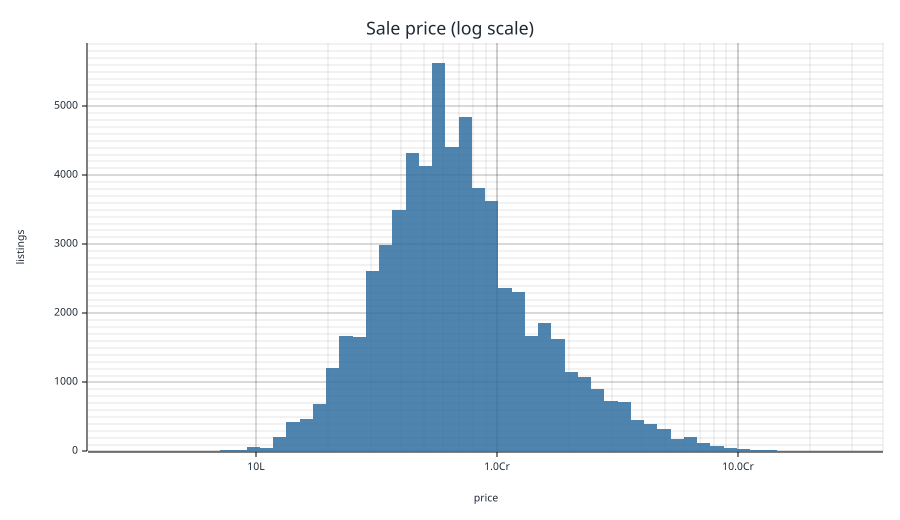
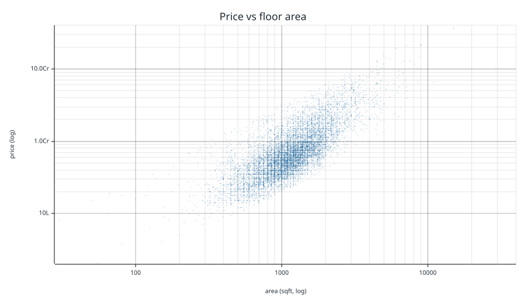
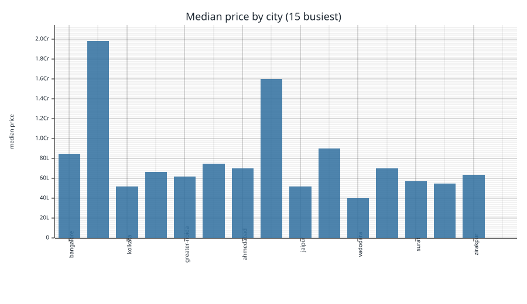
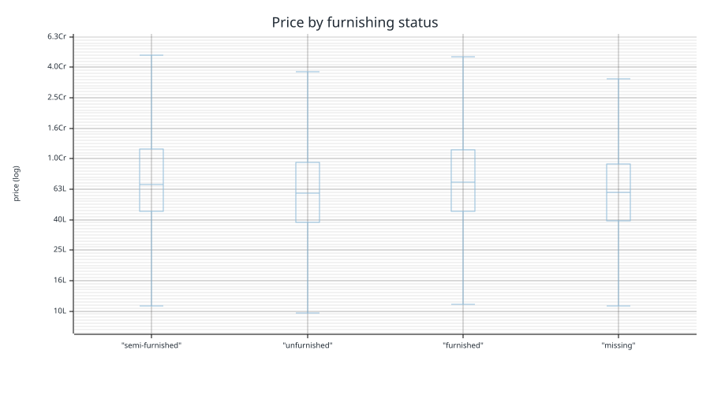
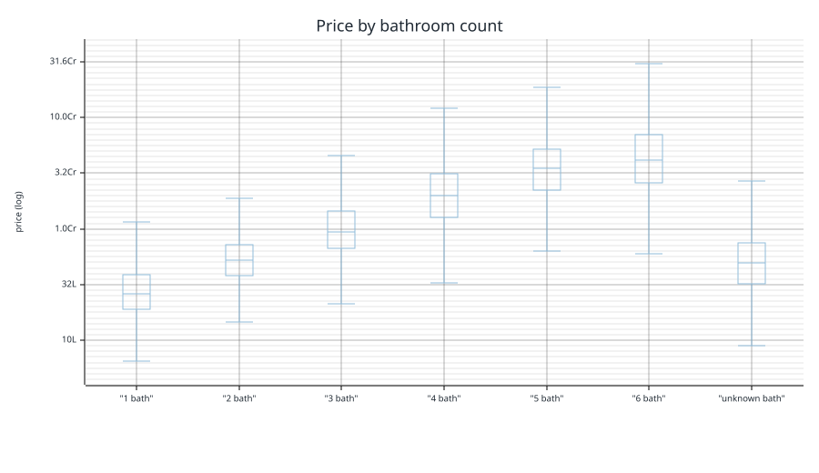
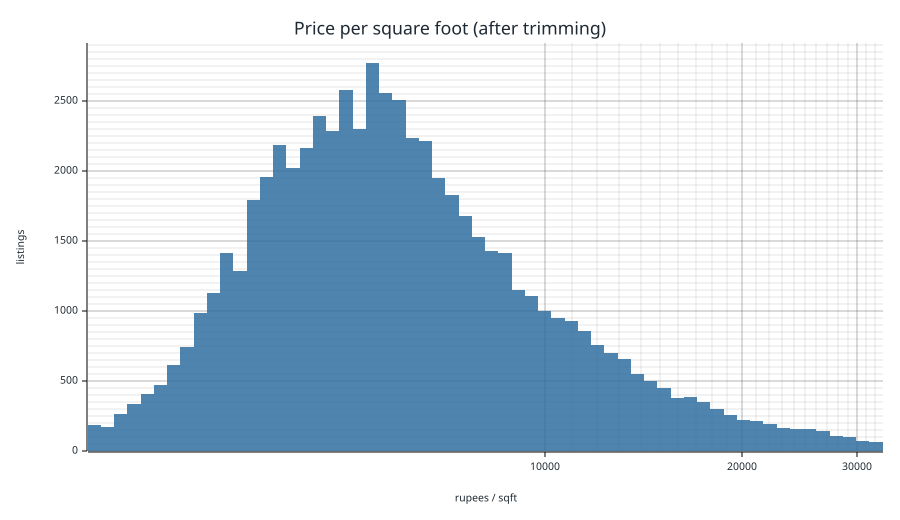
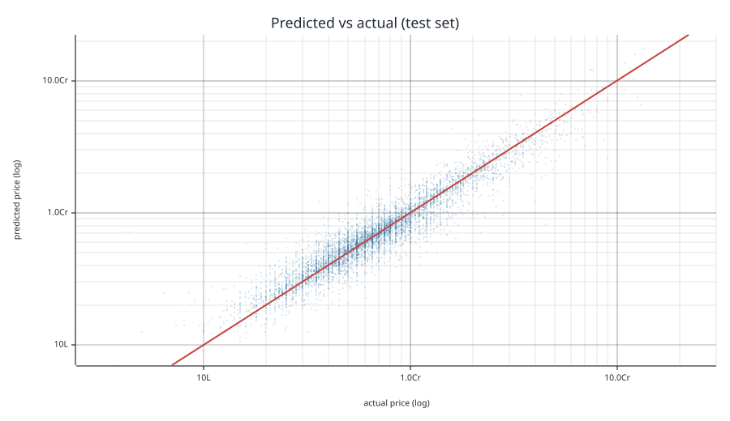
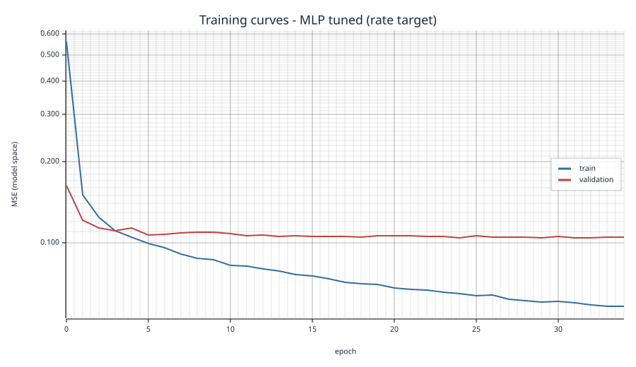

# House Price Prediction - model report

Generated by `cargo run --release -p ml`. Every number here was measured in that run, and the charts are saved next to this file.

The model is trained with [Vearo](https://github.com/razecrs/vearo), a Rust deep learning framework, so there's no Python in this project. The cleaning, the charts and this report are Rust too.

## 1. Load and inspect

The raw file is **187,531 rows x 20 columns**. Looking at it properly first changed three decisions, so it's worth doing before trusting the column names.

| column | missing | distinct | example |
|---|---|---|---|
| `Title` | 0.0% | 32446 | 1 BHK Ready to Occupy Flat for sale in S... |
| `Description` | 1.6% | 65635 | Bhiwandi, Thane has an attractive 1 BHK ... |
| `Amount(in rupees)` | 0.0% | 1561 | 42 Lac |
| `Price (in rupees)` | 9.4% | 10959 | 6000 |
| `location` | 0.0% | 81 | thane |
| `Carpet Area` | 43.0% | 2759 | 500 sqft |
| `Status` | 0.3% | 2 | Ready to Move |
| `Floor` | 3.8% | 948 | 10 out of 11 |
| `Transaction` | 0.0% | 5 | Resale |
| `Furnishing` | 1.5% | 4 | Unfurnished |
| `facing` | 37.5% | 9 | East |
| `overlooking` | 43.4% | 20 | Garden/Park |
| `Society` | 58.5% | 10377 | Srushti Siddhi Mangal Murti Complex |
| `Bathroom` | 0.4% | 12 | 1 |
| `Balcony` | 26.1% | 12 | 2 |
| `Car Parking` | 55.1% | 230 | 1 Open |
| `Ownership` | 34.9% | 5 | Freehold |
| `Super Area` | 57.4% | 2977 | 680 sqft |
| `Dimensions` | 100.0% | 1 |  |
| `Plot Area` | 100.0% | 1 |  |

Three things the table contradicts:

1. **`location` is a city, not a neighbourhood.** It has 81 distinct values across 187k rows - `new-delhi`, `bangalore`, `kolkata`. Keeping the top 50 and bucketing the rest therefore costs almost nothing here, but it still runs, because it is what makes an unseen city safe at inference time.
2. **`Price (in rupees)` is not the price.** Its values sit in the thousands while `Amount(in rupees)` holds `42 Lac`. It is the *rate per square foot*, so using it as a feature would leak the target: rate x area is the answer. It is excluded from the model.
3. **`Dimensions`, `Plot Area` and `Status` carry no information.** The first two are 100% blank; `Status` is `Ready to Move` in every non-blank row. All three are dropped.

## 2. Cleaning and feature engineering

| step | rows |
|---|---|
| raw | 187,531 |
| dropped: no usable price (`Call for Price` or blank) | -9,684 |
| dropped: no usable area in either area column | -90 |
| dropped: duplicate listings | -113,758 |
| dropped: price-per-sqft outside the 1st-99th percentile | -1,227 |
| **kept** | **62,772** |

### The duplicates are the story

**113,758 of the 187,531 rows (61%) are repeats.** Ignoring the `Index` column the file holds only 63,999 distinct listings, and the most repeated advertisement appears **821 times**. Splitting a file like that at random puts the same listing on both sides of the split, and the test set stops measuring prediction and starts measuring memory.

So de-duplication happens *before* the split. Two rows are the same listing when every feature the model sees and the price are identical; `Index` and the free-text columns are not part of that key, because they differ between copies of what is plainly one advertisement. Section 5 puts a number on what this was worth.

### What each messy column needed

- **Price is text.** `Amount(in rupees)` is `"42 Lac"`, `"1.40 Cr"` or `"Call for Price"`. Parsed with 1 Lac = 100,000 and 1 Cr = 10,000,000; the 9,684 `Call for Price` rows have no target and are dropped rather than guessed at.
- **Areas are text, in ten different units.** `Carpet Area` and `Super Area` are `"1200 sqft"`, `"140 sqyrd"`, `"90 sqm"`, and a long tail of `marla`, `kanal`, `bigha`, `acre`. Everything is converted to square feet through a unit table; an unknown unit returns nothing instead of a wrong number.
- **Two area columns, each mostly empty.** Carpet is 43% present and super area 57%, but between them all but 90 rows have one. Carpet area is the honest measurement, so it wins when both exist, and a binary `is_carpet_area` feature tells the model which one it is looking at - super area is systematically larger, and without the flag that difference would read as noise.
- **`Floor` is `"3 out of 10"`.** Split into the storey and the building height, with `Ground` = 0, `Basement` = -1, `Lower Basement` = -2. A `floor_ratio` feature carries how high up the flat is relative to the building.
- **`Bathroom` and `Balcony` contain `"> 10"`,** which becomes 11: it preserves the ordering without inventing a precise value.
- **`Car Parking` is `"1 Covered"`, `"2 Open"`, and sometimes `"1 Covered,"`** with a trailing comma. Split into a count and a `covered` flag.
- **`overlooking` is a set, not a category.** `"Garden/Park, Pool, Main Road"` in inconsistent orders makes 20 distinct strings out of 3 facts, so it becomes three binary features instead of a 20-way one-hot.
- **`facing` spells one direction two ways** (`"South - West"` and `"South -West"`); punctuation and spaces are stripped before encoding.
- **Missing values become their own category.** Blank `facing` and blank `Ownership` are 37% and 35% of the file - too many to drop, and their absence is plausibly informative, so they encode as `missing` rather than being imputed away.

**`Society` is dropped, and this is the measurement behind that.** It has 10376 distinct values and is 58% blank. The 50 most common societies together cover only 19.4% of rows, so a top-50-plus-`other` encoding would put ~81% of listings in the catch-all bucket and buy 50 columns of almost pure noise. `location` gets the top-N treatment; `Society` is not worth its dimensions.

**Outliers.** Price per square foot was computed for every row, and the tails past the 1st and 99th percentile trimmed: everything kept prices between 2000 and 32800 rupees/sqft. That removed 1,227 rows.

## 3. Exploratory data analysis

### Price is heavily skewed

The median listing is **65.00 Lac**, the middle half runs 42.00 Lac to 1.06 Cr, and the 1st and 99th percentiles are 15.00 Lac and 5.70 Cr. The mean is 1.51x the median - that ratio *is* the skew. On a linear axis this chart is one bar against the y axis; on a log axis it is close to symmetric, which is the entire argument for training on log price.

### Price against area

Log area and log price correlate at **r = 0.755**. A straight line on a log-log plot is a power law, so area enters the model as `log(area)` rather than raw square feet. The vertical banding is real: listings cluster on round numbers like 1000 and 1200 sqft. Both scatter charts draw an evenly spaced 12,000-listing sample - plotting every row makes a 4 MB file and no clearer a picture - but their axis limits come from the full data.

### Where the listings are

| city | listings | median price |
|---|---|---|
| bangalore | 2,876 | 85.00 Lac |
| gurgaon | 2,838 | 1.98 Cr |
| kolkata | 2,837 | 52.00 Lac |
| chennai | 2,835 | 66.90 Lac |
| greater-noida | 2,821 | 62.00 Lac |
| faridabad | 2,808 | 75.00 Lac |
| ahmedabad | 2,800 | 70.00 Lac |
| new-delhi | 2,677 | 1.60 Cr |
| jaipur | 2,655 | 52.00 Lac |
| hyderabad | 2,650 | 90.00 Lac |
| vadodara | 2,290 | 40.00 Lac |
| pune | 2,161 | 70.00 Lac |
| surat | 2,123 | 57.00 Lac |
| visakhapatnam | 1,683 | 55.00 Lac |
| zirakpur | 1,402 | 63.90 Lac |

Among the busiest cities the median ranges from 40.00 Lac in vadodara to 1.98 Cr in gurgaon - a **5.0x spread** on location alone, which is why city is the largest block of one-hot columns in the model.

### Furnishing and bathrooms

- `semi-furnished`: 26,871 listings, median 68.00 Lac
- `unfurnished`: 26,360 listings, median 59.50 Lac
- `furnished`: 8,425 listings, median 70.00 Lac
- `missing`: 1,116 listings, median 60.00 Lac

The boxes overlap heavily, so furnishing shifts the price but nowhere near decides it - useful as a feature, useless on its own.

- 1 bathrooms: 6,087 listings, median 26.00 Lac
- 2 bathrooms: 32,164 listings, median 52.50 Lac
- 3 bathrooms: 18,204 listings, median 93.90 Lac
- 4 bathrooms: 4,554 listings, median 2.00 Cr
- 5 bathrooms: 1,160 listings, median 3.50 Cr
- 6 bathrooms: 160 listings, median 4.20 Cr
- unknown bathrooms: 367 listings, median 50.00 Lac

Bathroom count separates the groups far more cleanly than furnishing does. It is a proxy for size and segment at once, which is why it survives as a feature despite correlating with area.

### Price per square foot

After trimming, the median rate is **5670 rupees/sqft**. This is also the quantity the outlier filter is built on.

## 4. Features and split

62,772 kept rows are shuffled with a fixed seed and split **45,196 train / 5,022 validation / 12,554 test**. The shuffle matters because the file is sorted by city. Taking the last 20% would test on cities the model never trained on.

The scaler statistics, the imputation medians and the one-hot vocabularies are all fitted on the training split alone. Fitting them on everything would leak test data into the preprocessing and inflate every number below.

The encoded vector is **6135 features**: 15 numeric (standardised, missing values imputed with the training median) followed by one-hot blocks.

| block | columns |
|---|---|
| numeric | 15 |
| `location` one-hot | 82 |
| `locality` one-hot | 4001 |
| `society` one-hot | 2001 |
| `property_type` one-hot | 10 |
| `furnishing` one-hot | 5 |
| `transaction` one-hot | 5 |
| `ownership` one-hot | 6 |
| `facing` one-hot | 10 |

Every one-hot block ends with an `other` column, so a city the model never saw still encodes fine instead of failing or shifting all the later columns along by one.

## 5. Models

All three are trained with Vearo: mini-batch AdamW, batch 512, warmup plus cosine decay, MSE loss, and the epoch with the best validation loss is the one kept. The test split is scored exactly once, at the end.

| model | shape | parameters | best epoch | device | time | MAE | RMSE | R2 | MdAPE |
|---|---|---|---|---|---|---|---|---|---|
| Linear regression (rate target) | 6135-1 | 6,136 | 3 | cuda | 65s | 20.37 Lac | 50.47 Lac | 0.810 | 14.9% |
| MLP tuned (rate target) | 6135-128-64-1 | 793,729 | 24 | cuda | 307s | 17.65 Lac | 38.80 Lac | 0.888 | 12.9% |
| MLP tuned (raw target) | 6135-128-64-1 | 793,729 | 8 | cuda | 159s | 19.81 Lac | 40.35 Lac | 0.879 | 16.4% |
| *Rate card (city median rate x area)* | *no model* | *0* | *-* | *-* | *-* | 31.37 Lac | 69.23 Lac | 0.643 | 23.9% |

MAE, RMSE and R2 are in rupees on the test set. **MdAPE** is the median absolute percentage error and it's the one to look at. Prices cover two orders of magnitude, so an MAE in rupees is dominated by a few very expensive listings. MdAPE tells you how wrong a normal prediction is.

### What de-duplication was worth

The same architecture, trained and scored on the file exactly as it ships, with the 64% of duplicate rows left in:

| test split | MdAPE | R2 |
|---|---|---|
| duplicates left in | 2.2% | 0.924 |
| de-duplicated (this project) | 12.9% | 0.888 |

The first row is the nicer number and the useless one. Most of its test listings are also in its training set, so the model is just recalling prices it has already seen. The second row is what it does on listings it has actually never seen, and that's the number used everywhere else here.

### Predicted vs actual

Both axes are log rupees and the dashed line is a perfect prediction. The points sit close to the diagonal through the middle and flatten out at both ends, which is the model pulling extremes toward the average. Squared error loss does that.

### Training curves

Validation loss follows training loss instead of turning back up, so the exported model isn't overfitted. The gap between the lines is how much it memorised.

### Bonus: 5-fold cross-validation

| fold | R2 | MdAPE |
|---|---|---|
| 0 | 0.702 | 13.6% |
| 1 | 0.778 | 13.4% |
| 2 | 0.819 | 13.0% |
| 3 | 0.854 | 13.4% |
| 4 | 0.884 | 13.1% |
| **mean** | **0.807** (sd 0.064) | **13.3%** |

The spread across folds is small, so the single test-set number above is not a lucky split.

### Is this model any good?

Three reference points, all on the same held-out test split:

| | MdAPE | R2 | what it knows |
|---|---|---|---|
| Rate card | 23.9% | 0.643 | city and area, no model |
| Linear regression | 14.9% | 0.810 | all 89 engineered features, no interactions |
| MLP | 12.9% | 0.888 | the same features, with interactions |

**Yes, relative to what it is given.** The rate card is what an agent does on the back of an envelope, and the network cuts its typical error by 46% relative (23.9% to 12.9%) while lifting R2 from 0.643 to 0.888. Roughly half of that gain is the cleaning and encoding - the linear model on the same features already reaches 14.9% - and the other half is interactions the linear model cannot express, such as an extra bathroom being worth more in Mumbai than in Jaipur.

**No, in absolute terms, and the data is the reason.** A typical prediction is still 12.9% out, which is too loose to price a specific flat. The ceiling is `location`: it is a *city*, and in Indian property the neighbourhood dominates. Two 1,000 sqft flats in Mumbai can differ threefold between Bandra and Bhiwandi, and nothing in the 89 features distinguishes them - so that variance is simply unlearnable here. The rate card's 23.9% is a direct measurement of how much price variation city-plus-area leaves unexplained, and no model on these columns escapes much more of it than this one already does.

The locality is not missing from the file, though - it is sitting in `Title` ("for sale in Punjabi Bagh East") and `Description`, both currently unused. Parsing locality and BHK count out of that text is where the next real gain is, and it is a text-parsing problem rather than a modelling one.

## 6. Conclusion and export

**MLP tuned (rate target) is the exported model.** It beats the linear baseline on every metric - MdAPE 12.9% against 14.9%, R2 0.888 against 0.810 - and the margin is worth the extra 787593 parameters. The baseline matters as much as the winner: a linear model on the same features reaches R2 0.810, so a good share of the signal is in the cleaning and the encoding, and the network adds the interactions on top - the fact that another bathroom is worth more in Mumbai than in Jaipur.

Three files are written to `models/`:

- `house_price.ve` - the weights, in Vearo's checkpoint format.
- `preprocess.json` - the feature spec: column order, imputation medians, scaler statistics, one-hot vocabularies, the target transform and the layer widths. The API loads this and calls the *same* encoder this pipeline used, from the shared `hp-core` crate, so training and serving cannot drift apart.
- `locations.json` - the cities the model has a column for, which populates the frontend dropdown.

After exporting, the pipeline builds a fresh network, loads the checkpoint into it, and asserts it reproduces a prediction to within 1e-6 - the equivalent of reloading a pickle before trusting it.

### What would improve this next

- `Title` and `Description` are free text holding the BHK count, which is currently unused; parsing bedrooms out of the title is likely the single biggest remaining gain.
- Both area columns are blank on only 90 rows, so imputing area would buy almost nothing - but 43% of listings have no *carpet* area and fall back to super area, and modelling the ratio between the two would sharpen those.
- The `other` city bucket is a blunt instrument. With a proper geographic hierarchy (state, then city) an unseen city could inherit its state's price level.
- De-duplication is exact-match. Two copies of one advertisement that differ by a single rounded square foot still both survive, so the real duplicate count is a floor, not a ceiling.
